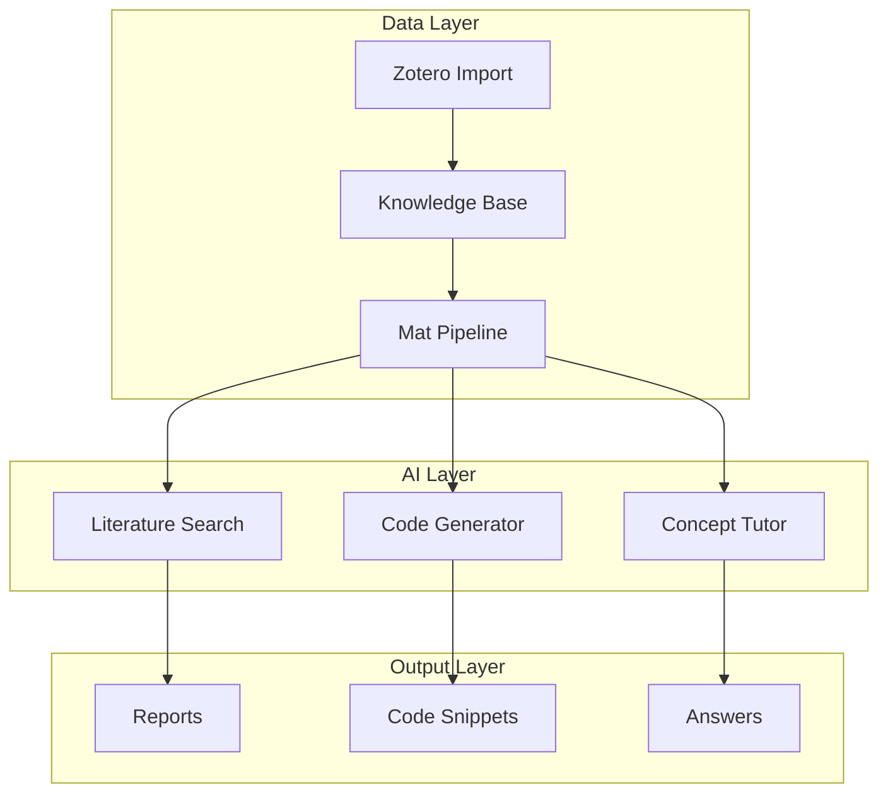

# Materials-AI-Kit

> AI-Powered Toolkit for Materials Science Research

[](https://opensource.org/licenses/MIT)
[](https://www.python.org/)

## Overview

Materials-AI-Kit is a comprehensive toolkit designed for materials scientists and researchers, integrating artificial intelligence capabilities into traditional materials research workflows. The toolkit focuses on **low-carbon building materials** and **cement-based systems**.

## Features

### 🧪 Data Processing Pipeline
- Automated data cleaning and normalization for materials datasets
- Feature engineering for material properties prediction
- Batch processing with progress tracking

### 📊 Knowledge Base Management
- Paper metadata extraction and indexing
- Citation network analysis
- Domain-specific knowledge organization

### 🤖 AI-Enhanced Tools
- Literature search and summarization
- Code generation for common materials science tasks
- Concept explanation and tutoring

### 🔬 Integration with Zotero
- One-click import from Zotero library
- Metadata synchronization
- Tag-based organization

## Architecture



## Quick Start

### Installation

```bash
git clone https://github.com/tsingxuanhan/materials-ai-kit.git
cd materials-ai-kit
pip install -r requirements.txt
```

### Basic Usage

```python
from mat_pipeline import MaterialsPipeline

# Initialize pipeline
pipeline = MaterialsPipeline()

# Process materials data
result = pipeline.process(
    data_path="your_data.csv",
    features=["chemical_composition", "curing_time", "temperature"]
)

# Generate predictions
predictions = pipeline.predict(result)
```

### Knowledge Base Search

```python
from kb.kb_update import KnowledgeBase

kb = KnowledgeBase()
results = kb.search("nano SiO2 supersulfated cement")
for paper in results:
    print(f"{paper['title']} - {paper['year']}")
```

## Project Structure

```
materials-ai-kit/
├── ai/                      # AI-enhanced tools
│   ├── gen_doc.py          # Documentation generation
│   └── review_code.py      # Code review assistant
├── data/                    # Data processing
│   ├── mat_features.py     # Feature engineering
│   └── mat_pipeline.py     # Processing pipeline
├── kb/                      # Knowledge base
│   ├── kb_update.py        # KB management
│   └── kb_validate.py      # Validation tools
├── system/                  # System utilities
│   ├── gpu_monitor.py      # GPU monitoring
│   └── health_check.py     # Health checks
├── zotero/                  # Zotero integration
│   ├── paper_to_kb.py      # Paper import
│   └── zotero_batch.py     # Batch operations
└── README.md
```

## Research Domains

The toolkit is specifically designed for:

| Domain | Focus Areas |
|--------|-------------|
| Low-Carbon Cement | SSC, MBCMs, LC3 systems |
| Supplementary Cementitious | Fly ash, slag, silica fume |
| Nano-Modification | SiO₂, TiO₂, CNTs |
| Concrete Durability | Chloride, sulfate, freeze-thaw |

## Contributing

Contributions are welcome! Please read our contribution guidelines before submitting PRs.

## License

MIT License - See [LICENSE](LICENSE) for details.
