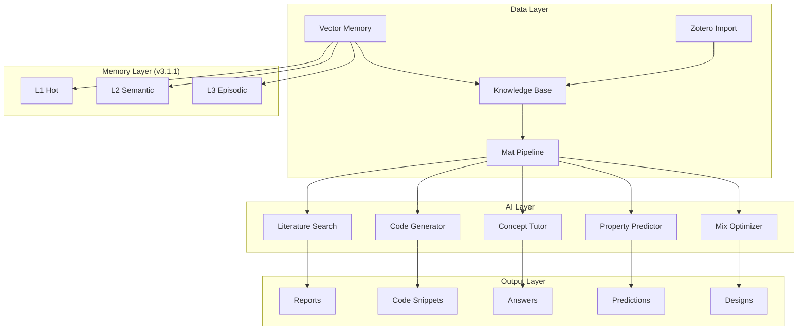

# Materials-AI-Kit

> AI-Powered Toolkit for Materials Science Research

[](https://opensource.org/licenses/MIT)
[](https://www.python.org/)
[](https://arxiv.org)

## Overview

Materials-AI-Kit is a comprehensive AI toolkit designed for materials scientists and researchers, focusing on **low-carbon building materials** and **cement-based systems**. It integrates machine learning capabilities into traditional materials research workflows.

**Key Components:**
- ML Models for property prediction and mix optimization
- Vector memory with NGram semantic search
- Multi-agent research automation (via Agent4Science integration)

## 🎮 Live Demo

Try the interactive AI Workstation demo with Liquid Glass design:

**[Open Demo](demo/index.html)** (Download and open in browser)

Features:
- Dashboard with 4 Agent status & API resource allocation
- Agent orchestration (Miner/Assayer/Caster/Artisan)
- Workflow pipeline with DAG visualization
- Knowledge base browser with domain files
- Model training playground (CNN/GNN/LSTM)
- Mix design prediction for cementitious materials

> All interactions use simulated data. Connect to real backend APIs for full functionality.

## Features

### ML Models

| Model | Description |
|-------|-------------|
| **PropertyPredictor** | CNN-based strength prediction with confidence intervals |
| **CompositionOptimizer** | Inverse design for target properties |
| **LSTMForwardModel** | Strength evolution curve prediction |

### Vector Memory (v3.1.1)

Semantic search powered by NGram TF-IDF embeddings:

```python
from vector_memory import NGramTFIDFProvider, PersistentVectorStore

# Create semantic memory
provider = NGramTFIDFProvider()
memory = PersistentVectorStore(provider=provider)

# Search materials knowledge
memory.add("SSC requires min 70% GGBS, max 5% clinker", metadata={"type": "composition"})
results = memory.search("ground granulated blast furnace slag cement", top_k=5)

# "nano SiO2" now matches "silica nanoparticle"!
```

**Key Features:**
- Word-level + character-level n-gram embeddings
- Captures subword similarity
- Persistent storage with JSON or ChromaDB backend
- Three-tier architecture (L1 Hot / L2 Semantic / L3 Episodic)

### Data Processing Pipeline

- Automated data cleaning and normalization
- Feature engineering for material properties
- Batch processing with progress tracking

### AI-Enabled Tools

- **Literature Search**: Semantic search and summarization
- **Code Generation**: Scripts for common materials science tasks
- **Concept Explanation**: Domain-specific tutoring
- **Property Prediction**: CNN-based strength prediction
- **Mix Optimization**: Inverse design for target properties

### Knowledge Base

- Paper metadata extraction and indexing
- Citation network analysis
- Domain knowledge organization
- Semantic vector search (NEW v3.1.1)

### Zotero Integration

- One-click import from Zotero library
- Metadata synchronization
- Tag-based organization

## Architecture



## Quick Start

### Installation

```bash
git clone https://github.com/tsingxuanhan/materials-ai-kit.git
cd materials-ai-kit
pip install -r requirements.txt
```

### Property Prediction

```python
from models.property_predictor import PropertyPredictor
import numpy as np

# Load or train model
predictor = PropertyPredictor()
# predictor.fit(X_train, y_train)  # Train on your data

# Predict strength
test_mix = {
    'cement': 350, 'slag': 50, 'gypsum': 10,
    'water': 175, 'fine_aggregate': 750, 'coarse_aggregate': 1000
}

result = predictor.predict_with_interval(test_mix)
print(f"Predicted: {result['mean']:.1f} MPa (95% CI: {result['lower']:.1f}-{result['upper']:.1f})")
```

### Mix Optimization

```python
from models.composition_optimizer import CompositionOptimizer

optimizer = CompositionOptimizer()
optimizer.fit(X_train, strength_curves)

# Find mix for target strength
result = optimizer.optimize(target_strength=40.0, target_age=28)
print(f"Optimized: Cement={result['composition']['cement']:.0f} kg/m³")
```

### Semantic Knowledge Search (NEW)

```python
from models.vector_memory import NGramTFIDFProvider, PersistentVectorStore

# Initialize memory
provider = NGramTFIDFProvider()
memory = PersistentVectorStore(provider=provider, persist_path="./kb_memory.json")

# Index materials knowledge
documents = [
    ("LC3: 50% limestone + 50% calcined clay, 5-30% OPC", {"type": "binder"}),
    ("SSC: min 70% GGBS, 10-15% gypsum, max 5% clinker", {"type": "binder"}),
    ("Nano SiO2 improves early strength by 20-30%", {"type": "admixture"}),
]

for content, meta in documents:
    memory.add(content, metadata=meta)

# Semantic search
results = memory.search("ground slag gypsum limestone blend", top_k=3)
for r in results:
    print(f"[{r.score:.3f}] {r.entry.content}")
```

## Project Structure

```
materials-ai-kit/
├── ai/                      # AI-enabled tools
├── data/                    # Data processing
├── kb/                      # Knowledge base
├── models/                  # ML models
│   ├── __init__.py
│   ├── composition_optimizer.py  # Inverse design
│   ├── property_predictor.py      # CNN prediction
│   └── vector_memory.py          # NGram semantic memory (NEW)
├── system/                  # System utilities
├── zotero/                  # Zotero integration
├── demo/                    # Interactive demo
├── README.md
└── requirements.txt
```

## Research Domains

The toolkit focuses on:

| Domain | Focus Areas |
|--------|-------------|
| Low-Carbon Cement | SSC, MBCMs, LC3 systems |
| Supplementary Cementitious | Fly ash, slag, silica fume |
| Nano-Modification | SiO₂, TiO₂, CNTs |
| Concrete Durability | Chloride, sulfate, freeze-thaw |

## Contributing

Contributions are welcome! Please read our contributing guidelines before submitting PRs.

## License

MIT License - See [LICENSE](LICENSE) for details.
